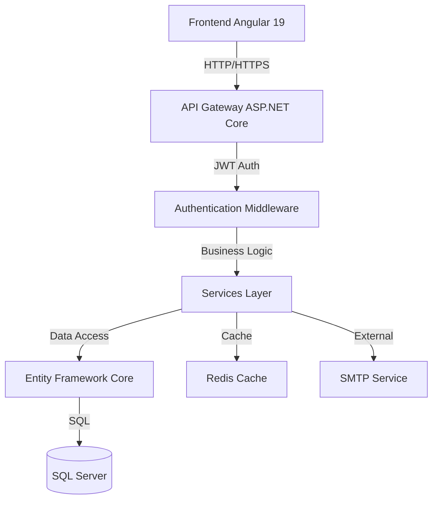

# 🎫 Ticket Management System

## 📋 Descripción

Sistema completo de gestión de tickets desarrollado con arquitectura moderna full-stack, utilizando ASP.NET Core para el backend y Angular para el frontend. Incluye autenticación JWT, base de datos SQL Server con Entity Framework Core, y una interfaz de usuario responsive.

## 🏗️ Arquitectura



## 🚀 Tecnologías

### Backend
- .NET 9.0
- Entity Framework Core 9.0
- ASP.NET Core Web API
- SQL Server 2022
- JWT Authentication
- Swagger/OpenAPI

### Frontend
- Angular 19+
- TypeScript 5.x
- RxJS
- Angular Material (opcional)

## 📦 Instalación

### Requisitos Previos
- .NET 9 SDK
- Node.js 20+
- SQL Server 2022
- Angular CLI 19

### Backend
```bash
cd backend/TicketManagementSystem.API
dotnet restore
dotnet ef database update
dotnet run
```

### Frontend
```bash
cd frontend/ticket-system-app
npm install
npm start
```

## ⚙️ Configuración

### appsettings.json (Backend)
```json
{
  "ConnectionStrings": {
    "DefaultConnection": "Server=localhost;Database=TicketDB;Trusted_Connection=true;"
  },
  "Jwt": {
    "SecretKey": "your-secret-key-here",
    "Issuer": "TicketSystem",
    "Audience": "TicketSystemUsers"
  }
}
```

### environment.ts (Frontend)
```typescript
export const environment = {
  production: false,
  apiUrl: 'https://localhost:5001/api'
};
```

## 🔑 Variables de Entorno

| Variable | Descripción | Requerido | Default |
|----------|-------------|-----------|---------|
| `ConnectionStrings__DefaultConnection` | SQL Server connection | Sí | - |
| `Jwt__SecretKey` | JWT secret key | Sí | - |
| `SMTP__Host` | SMTP server | No | localhost |
| `Redis__ConnectionString` | Redis connection | No | localhost:6379 |

## 📚 Documentación Adicional

- [Guía de Arquitectura](docs/ARCHITECTURE.md)
- [API Documentation](docs/API.md)
- [Guía de Desarrollo](docs/DEVELOPMENT.md)
- [Deployment Guide](docs/DEPLOYMENT.md)

## 🧪 Testing

```bash
# Backend Unit Tests
dotnet test

# Frontend Unit Tests
npm run test:ci

# E2E Tests
npm run cy:run
```

## 🐛 Troubleshooting

### Error: "Database connection failed"
**Solución**: Verificar connection string en appsettings.json

### Error: "JWT token invalid"
**Solución**: Verificar que JWT__SecretKey esté configurado

## 📄 Licencia

MIT License - Ver [LICENSE](LICENSE) para detalles

## 👥 Contribuidores

- Desarrollador Principal (@dev)

---

**Proyecto desarrollado como parte del curso "GitHub Copilot para Desarrolladores Web (.Net y Angular)" - Noviembre 2025**