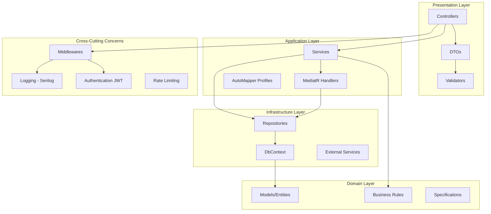
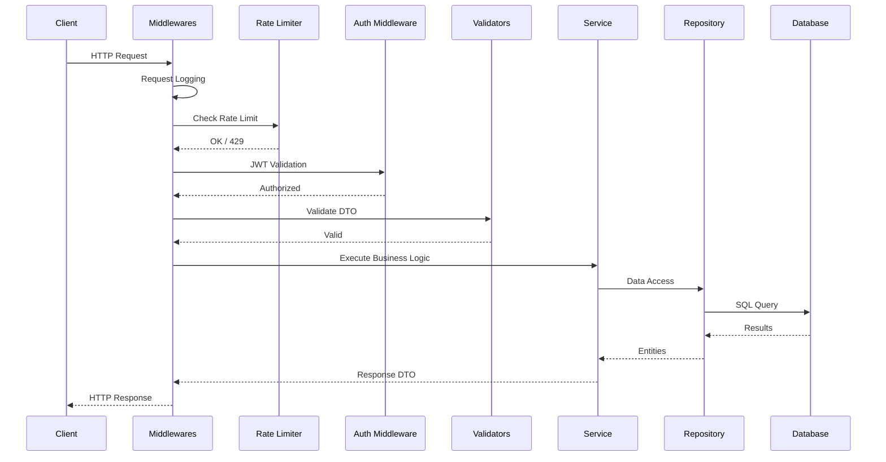
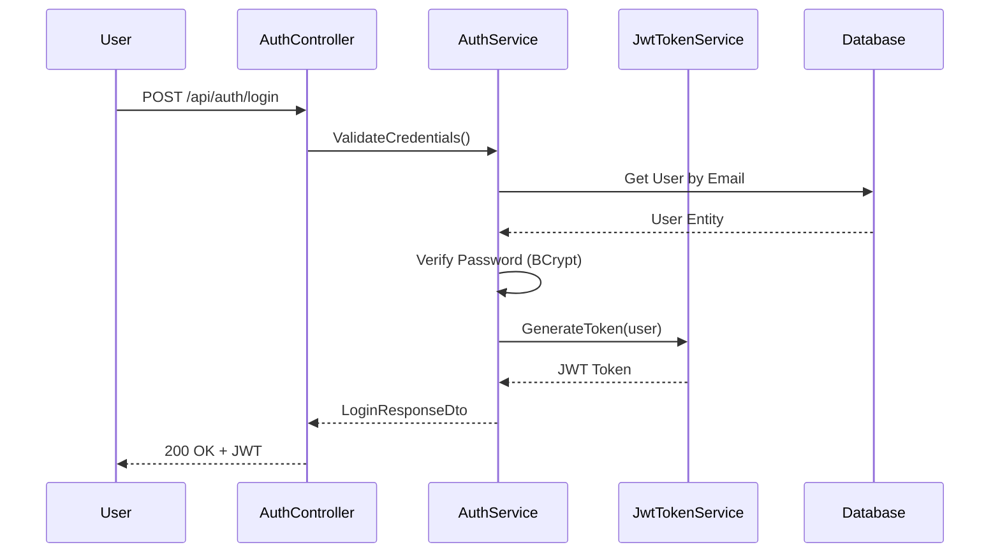
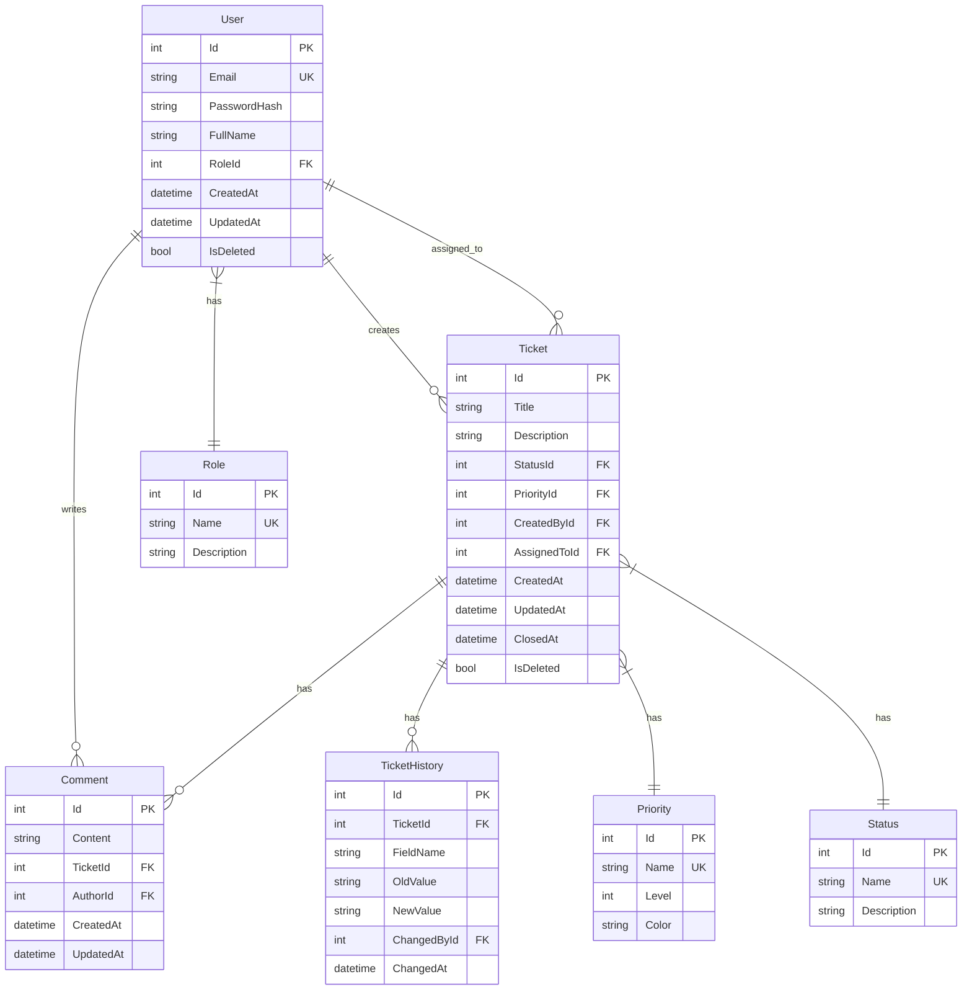

# 🎫 Ticket Management System - Backend API

[](https://dotnet.microsoft.com/)
[](https://docs.microsoft.com/ef/)
[](https://www.sqlite.org/)
[](https://swagger.io/)
[](../LICENSE)

> Robust RESTful API for the ticket management system, built with ASP.NET Core 8, clean architecture, and development best practices.

## 📋 Table of Contents

- [🏗️ Architecture](#️-architecture)
- [📁 Project Structure](#-project-structure)
- [🛠️ Technologies and Packages](#️-technologies-and-packages)
- [🚀 Installation and Configuration](#-installation-and-configuration)
- [🔐 Authentication and Authorization](#-authentication-and-authorization)
- [📡 API Endpoints](#-api-endpoints)
- [🗄️ Database](#️-database)
- [⚡ Rate Limiting](#-rate-limiting)
- [📊 Logging and Monitoring](#-logging-and-monitoring)
- [🧪 Testing](#-testing)
- [🔧 Advanced Configuration](#-advanced-configuration)
- [🐛 Troubleshooting](#-troubleshooting)

---

## 🏗️ Architecture

### Architecture Diagram



### HTTP Request Flow



### Implemented Design Patterns

| Pattern | Implementation | Purpose |
|---------|----------------|---------|
| **Repository Pattern** | `ITicketRepository`, `IUserRepository` | Data access abstraction |
| **Unit of Work** | `IUnitOfWork` | Transaction management |
| **CQRS** | `MediatR` handlers | Command and query separation |
| **Mediator** | `MediatR` | Component decoupling |
| **Strategy** | `IPasswordHasher` | Interchangeable algorithms |
| **Specification** | `Specifications/` | Query criteria encapsulation |

---

## 📁 Project Structure

```
TicketManagementSystem.API/
├── Controllers/                    # 🎮 API Controllers
│   ├── AuthController.cs          # Authentication and registration
│   ├── TicketsController.cs       # Ticket CRUD operations
│   ├── UsersController.cs         # User management
│   ├── CommentsController.cs      # Ticket comments
│   ├── PrioritiesController.cs    # Priority catalog
│   ├── RolesController.cs         # Role management
│   └── BaseApiController.cs       # Base controller
├── DTOs/                          # 📦 Data Transfer Objects
│   ├── CreateTicketDto.cs         # Ticket creation
│   ├── UpdateTicketDto.cs         # Ticket update
│   ├── TicketDto.cs               # Ticket response
│   ├── LoginDto.cs                # Login request
│   ├── LoginResponseDto.cs        # Login response with JWT
│   ├── RegisterDto.cs             # Registration request
│   ├── PagedResponse.cs           # Generic paginated response
│   └── ...
├── Models/                        # 🏛️ Domain Entities
│   ├── Ticket.cs                  # Main entity
│   ├── User.cs                    # System user
│   ├── Comment.cs                 # Comments
│   ├── Priority.cs                # Priority levels
│   ├── Status.cs                  # Ticket statuses
│   ├── Role.cs                    # User roles
│   └── TicketHistory.cs           # Change history
├── Services/                      # 🔧 Business Logic
│   ├── ITicketService.cs          # Ticket interface
│   ├── TicketService.cs           # Implementation
│   ├── IAuthService.cs            # Authentication interface
│   ├── AuthService.cs             # JWT implementation
│   ├── JwtTokenService.cs         # Token generation
│   ├── IUserService.cs            # User interface
│   ├── UserService.cs             # Implementation
│   ├── EmailNotificationService.cs # Email notifications
│   └── ...
├── Repositories/                  # 💾 Data Access
│   ├── ITicketRepository.cs       # Generic interface
│   ├── TicketRepository.cs        # Implementation
│   ├── IUserRepository.cs
│   ├── UserRepository.cs
│   ├── IUnitOfWork.cs             # Unit of Work pattern
│   └── UnitOfWork.cs
├── Data/                          # 🗄️ Entity Framework
│   └── ApplicationDbContext.cs    # Main DbContext
├── Validators/                    # ✅ FluentValidation
│   ├── CreateTicketDtoValidator.cs
│   ├── UpdateTicketDtoValidator.cs
│   ├── LoginDtoValidator.cs
│   └── RegisterDtoValidator.cs
├── Mappings/                      # 🔄 AutoMapper Profiles
│   ├── TicketMappingProfile.cs
│   ├── UserMappingProfile.cs
│   └── RoleMappingProfile.cs
├── Middlewares/                   # 🛡️ Middleware Pipeline
│   ├── ExceptionHandlerMiddleware.cs
│   ├── RequestLoggingMiddleware.cs
│   └── GlobalExceptionMiddleware.cs
├── MediatR/                       # 📨 CQRS Handlers
│   └── Behaviors/
│       └── LoggingBehavior.cs
├── Specifications/                # 🔍 Specification Pattern
├── Helpers/                       # 🔨 Utilities
│   └── CacheHelper.cs
├── Features/                      # 🎯 Vertical Slices
├── CQRS/                          # 📊 Commands & Queries
├── Tests/                         # 🧪 Unit Tests
├── Program.cs                     # 🚀 Entry Point
├── appsettings.json               # ⚙️ Configuration
└── TicketManagementSystem.API.csproj
```

---

## 🛠️ Technologies and Packages

### Framework and Runtime
| Package | Version | Purpose |
|---------|---------|---------|
| .NET | 8.0 | Main framework |
| ASP.NET Core | 8.0 | Web API |

### Persistence and ORM
| Package | Version | Purpose |
|---------|---------|---------|
| Microsoft.EntityFrameworkCore | 8.0.0 | Main ORM |
| Microsoft.EntityFrameworkCore.Sqlite | 8.0.0 | SQLite Provider |
| Microsoft.EntityFrameworkCore.Design | 8.0.0 | Migration tools |
| Microsoft.EntityFrameworkCore.Tools | 8.0.0 | CLI Tools |

### Authentication and Security
| Package | Version | Purpose |
|---------|---------|---------|
| Microsoft.AspNetCore.Authentication.JwtBearer | 8.0.0 | JWT Bearer tokens |
| System.IdentityModel.Tokens.Jwt | 8.3.0 | JWT generation |
| BCrypt.Net-Next | 4.0.3 | Password hashing |
| AspNetCoreRateLimit | 5.0.0 | Rate limiting |

### Validation and Mapping
| Package | Version | Purpose |
|---------|---------|---------|
| FluentValidation.AspNetCore | 11.3.0 | DTO validation |
| AutoMapper | 12.0.1 | Object-to-object mapping |

### CQRS and Messaging
| Package | Version | Purpose |
|---------|---------|---------|
| MediatR | 13.1.0 | Mediator/CQRS pattern |

### Logging and Monitoring
| Package | Version | Purpose |
|---------|---------|---------|
| Serilog.AspNetCore | 8.0.1 | Structured logging |
| Serilog.Sinks.Console | 5.0.1 | Console output |
| Serilog.Sinks.File | 5.0.0 | File output |

### API Documentation
| Package | Version | Purpose |
|---------|---------|---------|
| Swashbuckle.AspNetCore | 6.5.0 | Swagger/OpenAPI |
| Swashbuckle.AspNetCore.Annotations | 6.5.0 | Swagger annotations |
| Swashbuckle.AspNetCore.Filters | 8.0.2 | Swagger examples |

### Communications
| Package | Version | Purpose |
|---------|---------|---------|
| MailKit | 4.3.0 | Email sending |
| MimeKit | 4.7.1 | Email building |

### Others
| Package | Version | Purpose |
|---------|---------|---------|
| Polly | 8.2.0 | Resilience patterns |
| QuestPDF | 2025.7.4 | PDF report generation |
| Hellang.Middleware.ProblemDetails | 6.5.1 | RFC 7807 Problem Details |

### Testing
| Package | Version | Purpose |
|---------|---------|---------|
| xUnit | 2.5.3 | Testing framework |
| Moq | 4.20.70 | Mocking |
| FluentAssertions | 6.12.0 | Readable assertions |
| Microsoft.AspNetCore.Mvc.Testing | 8.0.0 | Integration tests |

---

## 🚀 Installation and Configuration

### Prerequisites

- [.NET 8 SDK](https://dotnet.microsoft.com/download/dotnet/8.0)
- Code editor (VS Code, Visual Studio 2022+, Rider)
- Git

### Quick Installation

```powershell
# Clone the repository
git clone https://github.com/tu-usuario/copilot-curso-2025.git
cd copilot-curso-2025/TicketManagementSystem/backend/TicketManagementSystem.API

# Restore packages
dotnet restore

# Create the database (SQLite is created automatically)
dotnet ef database update

# Run the application
dotnet run
```

### Environment Variables

Create a `.env` file based on `.env.example`:

```env
# Database
ConnectionStrings__DefaultConnection=Data Source=TicketManagementDb.db

# JWT Configuration
Jwt__Key=YourSuperSecretKeyHere_MakeItVeryLongAndSecure123456789
Jwt__Issuer=TicketManagementAPI
Jwt__Audience=TicketManagementClients
Jwt__ExpiryInMinutes=60

# SMTP (Optional)
SmtpSettings__Host=smtp.gmail.com
SmtpSettings__Port=587
SmtpSettings__Username=your-email@gmail.com
SmtpSettings__Password=your-app-password
```

### appsettings.json Configuration

```json
{
  "ConnectionStrings": {
    "DefaultConnection": "Data Source=TicketManagementDb.db"
  },
  "Jwt": {
    "Key": "YourSuperSecretKeyHere_MakeItVeryLongAndSecure123456789",
    "Issuer": "TicketManagementAPI",
    "Audience": "TicketManagementClients",
    "ExpiryInMinutes": 60
  },
  "Serilog": {
    "MinimumLevel": {
      "Default": "Information",
      "Override": {
        "Microsoft": "Warning",
        "System": "Warning"
      }
    }
  },
  "IpRateLimiting": {
    "EnableEndpointRateLimiting": true,
    "GeneralRules": [
      { "Endpoint": "*", "Period": "1m", "Limit": 200 },
      { "Endpoint": "POST:/api/auth/login", "Period": "1m", "Limit": 20 }
    ]
  }
}
```

### Running in Development

```powershell
# Development mode with hot reload
dotnet watch run

# The API will be available at:
# - HTTP:  http://localhost:5000
# - HTTPS: https://localhost:5001
# - Swagger: https://localhost:5001/swagger
```

---

## 🔐 Authentication and Authorization

### JWT Authentication Flow



### System Roles

| Role | Permissions |
|------|-------------|
| `Admin` | Full system access |
| `Agent` | Manage assigned tickets, comments |
| `User` | Create tickets, view own tickets |

### Authorization Policies

```csharp
// Defined in Program.cs
options.AddPolicy("RequireAdminRole", policy => 
    policy.RequireRole("Admin"));

options.AddPolicy("RequireAdminOrAgentRole", policy => 
    policy.RequireRole("Admin", "Agent"));

options.AddPolicy("RequireAuthenticatedUser", policy => 
    policy.RequireAuthenticatedUser());
```

### Usage in Controllers

```csharp
[Authorize(Policy = "RequireAdminRole")]
[HttpDelete("{id}")]
public async Task<IActionResult> DeleteTicket(int id) { ... }

[Authorize(Policy = "RequireAuthenticatedUser")]
[HttpGet]
public async Task<IActionResult> GetMyTickets() { ... }
```

---

## 📡 API Endpoints

### Authentication `/api/auth`

| Method | Endpoint | Description | Auth |
|--------|----------|-------------|------|
| `POST` | `/login` | Sign in | ❌ |
| `POST` | `/register` | Register user | ❌ |
| `POST` | `/refresh` | Refresh token | ✅ |
| `POST` | `/logout` | Sign out | ✅ |

### Tickets `/api/tickets`

| Method | Endpoint | Description | Auth | Roles |
|--------|----------|-------------|------|-------|
| `GET` | `/` | List tickets (paginated) | ✅ | All |
| `GET` | `/{id}` | Get ticket by ID | ✅ | All |
| `POST` | `/` | Create ticket | ✅ | All |
| `PUT` | `/{id}` | Update ticket | ✅ | Admin, Agent |
| `DELETE` | `/{id}` | Delete ticket | ✅ | Admin |
| `GET` | `/metrics` | Ticket statistics | ✅ | Admin |
| `GET` | `/{id}/history` | Change history | ✅ | All |

### Users `/api/users`

| Method | Endpoint | Description | Auth | Roles |
|--------|----------|-------------|------|-------|
| `GET` | `/` | List users | ✅ | Admin |
| `GET` | `/{id}` | Get user | ✅ | Admin |
| `PUT` | `/{id}` | Update user | ✅ | Admin |
| `DELETE` | `/{id}` | Delete user | ✅ | Admin |

### Comments `/api/comments`

| Method | Endpoint | Description | Auth |
|--------|----------|-------------|------|
| `GET` | `/ticket/{ticketId}` | Get ticket comments | ✅ |
| `POST` | `/` | Create comment | ✅ |
| `PUT` | `/{id}` | Update comment | ✅ |
| `DELETE` | `/{id}` | Delete comment | ✅ |

### Catalogs

| Method | Endpoint | Description |
|--------|----------|-------------|
| `GET` | `/api/priorities` | List priorities |
| `GET` | `/api/roles` | List roles |

### Health Checks

| Method | Endpoint | Description |
|--------|----------|-------------|
| `GET` | `/health` | API health status |
| `GET` | `/api/security/status` | Security status |

### Request/Response Examples

#### Login
```http
POST /api/auth/login
Content-Type: application/json

{
  "email": "admin@example.com",
  "password": "Admin123!"
}
```

**Response 200:**
```json
{
  "token": "eyJhbGciOiJIUzI1NiIsInR5cCI6IkpXVCJ9...",
  "refreshToken": "dGhpcyBpcyBhIHJlZnJlc2ggdG9rZW4...",
  "expiresAt": "2025-11-25T16:00:00Z",
  "user": {
    "id": 1,
    "email": "admin@example.com",
    "fullName": "System Administrator",
    "role": "Admin"
  }
}
```

#### Create Ticket
```http
POST /api/tickets
Authorization: Bearer {token}
Content-Type: application/json

{
  "title": "Login error",
  "description": "Cannot access the system",
  "priorityId": 2,
  "assignedToId": 3
}
```

---

## 🗄️ Database

### Data Model



### Migrations

```powershell
# Create new migration
dotnet ef migrations add MigrationName

# Apply migrations
dotnet ef database update

# Revert last migration
dotnet ef migrations remove

# Generate SQL script
dotnet ef migrations script
```

---

## ⚡ Rate Limiting

### Limit Configuration

```json
{
  "IpRateLimiting": {
    "EnableEndpointRateLimiting": true,
    "StackBlockedRequests": false,
    "HttpStatusCode": 429,
    "GeneralRules": [
      { "Endpoint": "*", "Period": "1m", "Limit": 200 },
      { "Endpoint": "POST:/api/auth/login", "Period": "1m", "Limit": 20 },
      { "Endpoint": "POST:/api/auth/register", "Period": "1m", "Limit": 10 },
      { "Endpoint": "GET:/api/tickets*", "Period": "1m", "Limit": 100 },
      { "Endpoint": "POST:/api/tickets*", "Period": "1m", "Limit": 30 }
    ]
  }
}
```

### 429 Response (Too Many Requests)

```json
{
  "type": "https://httpstatuses.com/429",
  "title": "Too Many Requests",
  "status": 429,
  "detail": "Rate limit exceeded. Try again in 60 seconds."
}
```

---

## 📊 Logging and Monitoring

### Serilog Configuration

Logs are written to:
- **Console**: Structured output in development
- **Files**: `logs/log-{date}.txt` with daily rotation

### Log Format

```
2025-11-25 10:30:45.123 -05:00 [INF] HTTP POST /api/auth/login responded 200 in 45.23ms
{"CorrelationId":"abc123","RequestPath":"/api/auth/login","StatusCode":200}
```

### Log Levels

| Level | Usage |
|-------|-------|
| `Verbose` | Detailed diagnostics |
| `Debug` | Development information |
| `Information` | Normal events |
| `Warning` | Unusual situations |
| `Error` | Recoverable errors |
| `Fatal` | Critical errors |

---

## 🧪 Testing

### Running Tests

```powershell
# All tests
dotnet test

# Tests with coverage
dotnet test --collect:"XPlat Code Coverage"

# Specific tests
dotnet test --filter "FullyQualifiedName~TicketServiceTests"
```

### Test Structure

```csharp
[Fact]
public async Task CreateTicket_ValidData_ReturnsCreatedTicket()
{
    // Arrange
    var createDto = new CreateTicketDto { Title = "Test", Description = "Test Desc" };
    _mockRepository.Setup(x => x.AddAsync(It.IsAny<Ticket>()))
                   .ReturnsAsync(new Ticket { Id = 1 });

    // Act
    var result = await _service.CreateAsync(createDto);

    // Assert
    result.Should().NotBeNull();
    result.Id.Should().Be(1);
}
```

---

## 🔧 Advanced Configuration

### Security Headers

The API automatically configures the following headers:

| Header | Value |
|--------|-------|
| `X-Content-Type-Options` | `nosniff` |
| `X-Frame-Options` | `DENY` |
| `X-XSS-Protection` | `1; mode=block` |
| `Referrer-Policy` | `strict-origin-when-cross-origin` |
| `Content-Security-Policy` | Restrictive configuration |

### CORS

```csharp
policy.WithOrigins(
    "http://localhost:4200",  // Angular dev
    "https://localhost:4200"
)
.WithMethods("GET", "POST", "PUT", "DELETE", "OPTIONS")
.WithHeaders("Authorization", "Content-Type", "Accept", 
             "X-Requested-With", "X-Correlation-ID")
.AllowCredentials();
```

---

## 🐛 Troubleshooting

### Error: "Database connection failed"

```powershell
# Verify database file exists
Test-Path TicketManagementDb.db

# Recreate the database
Remove-Item TicketManagementDb.db
dotnet ef database update
```

### Error: "JWT token invalid"

- Verify that `Jwt:Key` in `appsettings.json` has at least 32 characters
- Verify that the token has not expired
- Ensure the `Authorization: Bearer {token}` header is correct

### Error: "Rate limit exceeded"

Wait for the indicated time or adjust the limits in `appsettings.json` for development.

### Error: "CORS policy blocked"

Verify that the frontend origin is in the `WithOrigins()` list in `Program.cs`.

---

## 📚 Additional Documentation

- [📖 OpenAPI Specification](TicketManagementSystem.API/openapi.yaml) - Complete API specification
- [📖 API Specification](../api-specification.md)
- [🔒 Security Guidelines](SECURITY.md)
- [📊 Database Management](DATABASE_MANAGEMENT.md)
- [⚡ Rate Limiting](RATE_LIMITING.md)
- [🔧 Troubleshooting](../TROUBLESHOOTING.md)

### Import OpenAPI in Tools

```powershell
# Swagger UI (already included at /swagger)
# Postman - import openapi.yaml
# Insomnia - import openapi.yaml

# Generate client with NSwag
nswag openapi2csclient /input:openapi.yaml /output:ApiClient.cs
```

---

## 👥 Contributing

1. Fork the repository
2. Create feature branch: `git checkout -b feature/new-feature`
3. Commit changes: `git commit -m 'feat: add new feature'`
4. Push to branch: `git push origin feature/new-feature`
5. Create Pull Request

---

## 📄 License

This project is under the MIT License - see [LICENSE](../LICENSE) for details.

---

**Developed as part of the "GitHub Copilot for Web Developers (.NET and Angular)" course - November 2025** 🚀
