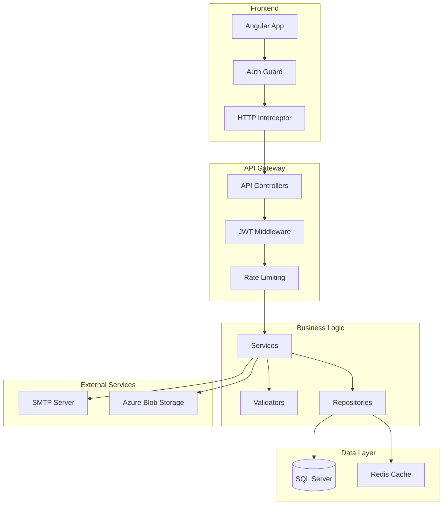
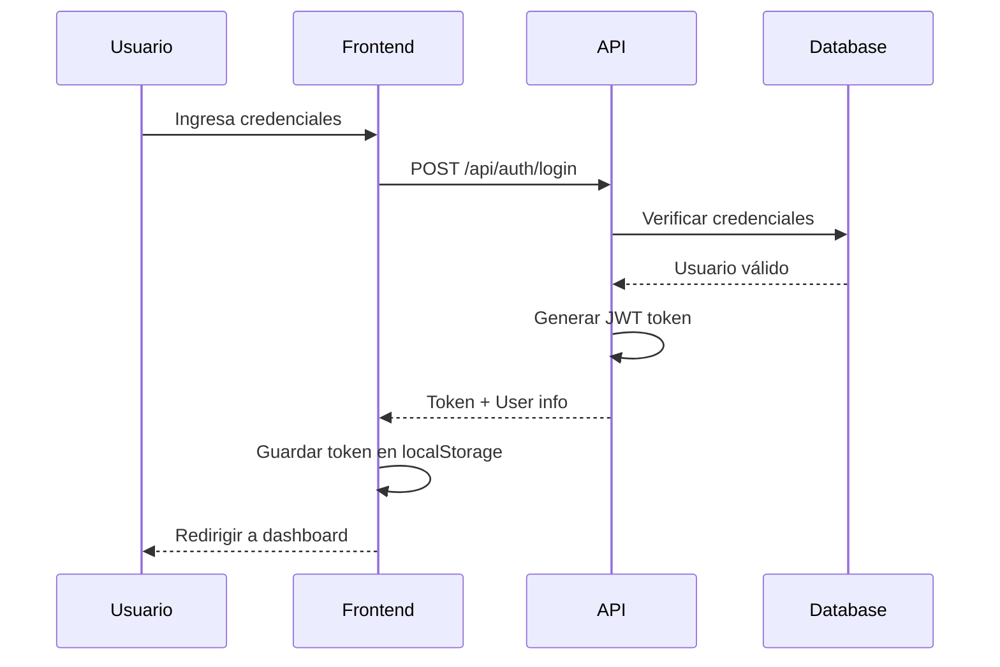
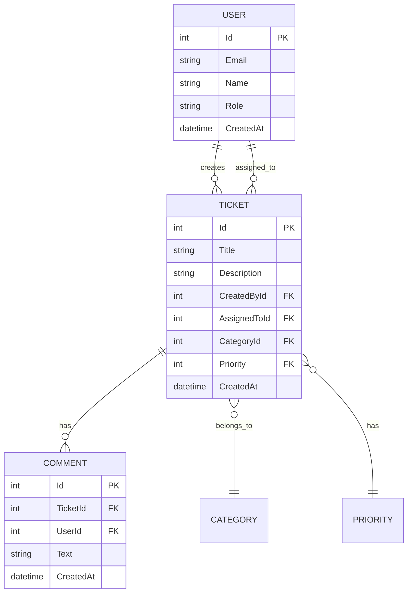

# Arquitectura del Sistema

## Diagrama de Arquitectura General

```mermaid
graph TB
    subgraph Frontend
        A[Angular App]
        B[Auth Guard]
        C[HTTP Interceptor]
    end

    subgraph API Gateway
        D[API Controllers]
        E[JWT Middleware]
        F[Rate Limiting]
    end

    subgraph Business Logic
        G[Services]
        H[Validators]
        I[Repositories]
    end

    subgraph Data Layer
        J[(SQL Server)]
        K[Redis Cache]
    end

    subgraph External Services
        L[SMTP Server]
        M[Azure Blob Storage]
    end

    A --> B
    B --> C
    C --> D
    D --> E
    E --> F
    F --> G
    G --> H
    G --> I
    I --> J
    I --> K
    G --> L
    G --> M
```

## Diagrama de Secuencia - Login Flow

```mermaid
sequenceDiagram
    participant U as Usuario
    participant F as Frontend
    participant A as API
    participant DB as Database

    U->>F: Ingresa credenciales
    F->>A: POST /api/auth/login
    A->>DB: Verificar credenciales
    DB-->>A: Usuario válido
    A->>A: Generar JWT token
    A-->>F: Token + User info
    F->>F: Guardar token en localStorage
    F-->>U: Redirigir a dashboard
```

## Entity Relationship Diagram

```mermaid
erDiagram
    USER ||--o{ TICKET : creates
    USER ||--o{ TICKET : assigned_to
    TICKET ||--o{ COMMENT : has
    TICKET }o--|| CATEGORY : belongs_to
    TICKET }o--|| PRIORITY : has

    USER {
        int Id PK
        string Email
        string Name
        string Role
        datetime CreatedAt
    }

    TICKET {
        int Id PK
        string Title
        string Description
        int CreatedById FK
        int AssignedToId FK
        int CategoryId FK
        int Priority FK
        datetime CreatedAt
    }

    COMMENT {
        int Id PK
        int TicketId FK
        int UserId FK
        string Text
        datetime CreatedAt
    }
```