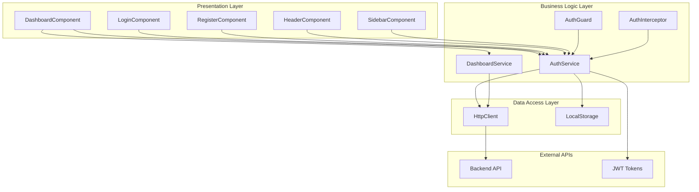
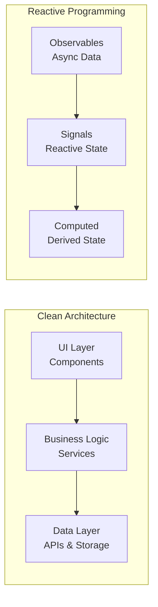
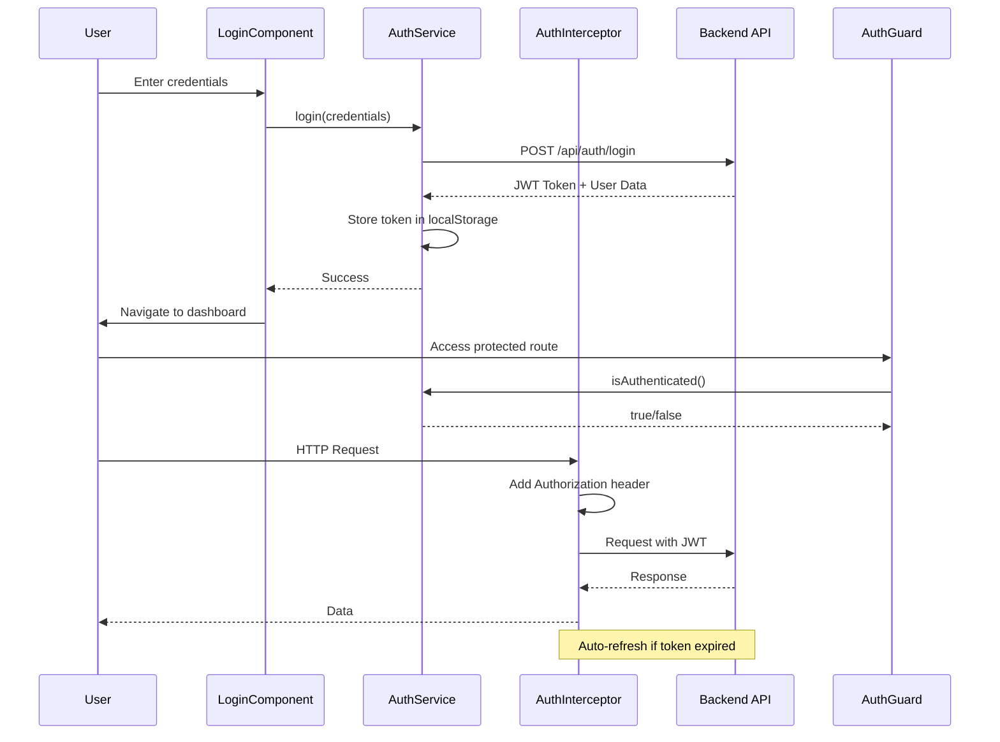
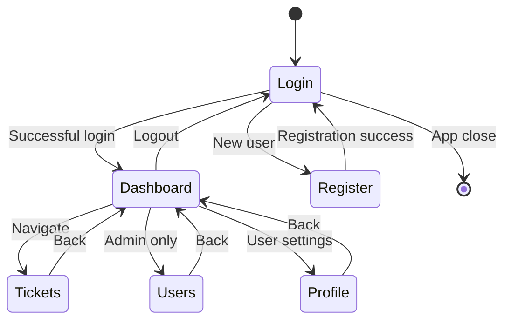
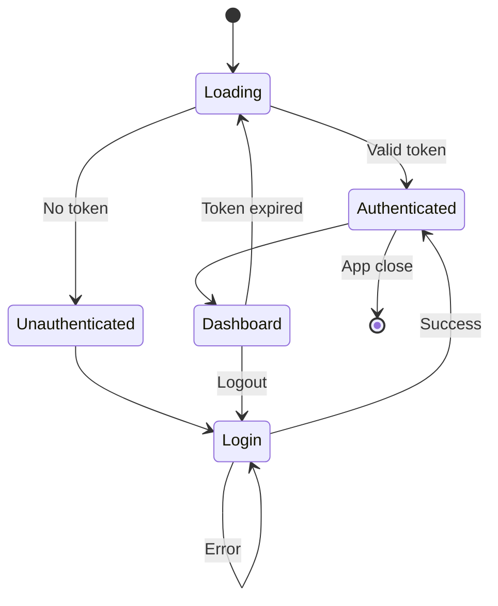
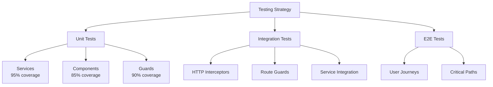

# 🎫 Ticket Management System - Frontend

[](https://angular.io/)
[](https://www.typescriptlang.org/)
[](https://tailwindcss.com/)
[](https://rxjs.dev/)
[](LICENSE)

> Sistema de gestión de tickets moderno construido con Angular 19, TypeScript y arquitectura limpia.

## 📋 Tabla de Contenidos

- [🏗️ Arquitectura General](#-arquitectura-general)
- [📁 Estructura de Carpetas](#-estructura-de-carpetas)
- [🛠️ Tecnologías](#️-tecnologías)
- [🔌 APIs y Endpoints](#-apis-y-endpoints)
- [🚀 Instalación](#-instalación)
- [💻 Uso](#-uso)
- [🧪 Testing](#-testing)
- [🤝 Contribución](#-contribución)
- [🗺️ Roadmap](#️-roadmap)

---

## 🏗️ Arquitectura General

### Diagrama de Arquitectura



### Patrón de Arquitectura



### Flujo de Autenticación



---

## 📁 Estructura de Carpetas

```
src/
├── app/
│   ├── core/                          # 🏢 Servicios core y lógica de negocio
│   │   ├── auth/                      # 🔐 Autenticación y autorización
│   │   │   ├── auth.service.ts        # Servicio de autenticación
│   │   │   └── auth.service.spec.ts   # Tests del servicio
│   │   ├── guards/                    # 🛡️ Guards de rutas
│   │   │   └── auth.guard.ts          # Guard de autenticación
│   │   ├── interceptors/              # 🔄 Interceptores HTTP
│   │   │   └── auth.interceptor.ts    # Interceptor JWT
│   │   └── services/                  # 🔧 Servicios de negocio
│   │       ├── dashboard.service.ts   # Servicio del dashboard
│   │       └── dashboard.service.spec.ts
│   ├── features/                      # 🎯 Módulos de características
│   │   └── dashboard/                 # 📊 Dashboard principal
│   │       ├── dashboard.component.ts
│   │       ├── dashboard.component.spec.ts
│   │       └── dashboard.component.html
│   ├── components/                    # 🧩 Componentes compartidos
│   │   └── layout/                    # 📐 Layout components
│   │       ├── header/                # Encabezado de la app
│   │       │   └── header.component.ts
│   │       └── sidebar/               # Barra lateral de navegación
│   │           └── sidebar.component.ts
│   ├── models/                        # 📋 Interfaces y tipos
│   │   ├── auth.interface.ts          # Interfaces de autenticación
│   │   └── dashboard.interface.ts     # Interfaces del dashboard
│   └── shared/                        # 🔄 Utilidades compartidas
│       └── utils/
├── assets/                            # 📁 Recursos estáticos
├── environments/                      # 🌍 Configuración por entorno
└── styles.css                         # 🎨 Estilos globales
```

---

## 🛠️ Tecnologías

### Core Framework
- **Angular 19.2.0** - Framework principal
- **TypeScript 5.7.2** - Tipado estático avanzado
- **RxJS 7.8.0** - Programación reactiva
- **Zone.js 0.15.0** - Change detection

### UI & Styling
- **Tailwind CSS 3.x** - Utility-first CSS framework
- **PostCSS** - CSS processing
- **Autoprefixer** - CSS vendor prefixes

### Development Tools
- **Angular CLI 19.2.19** - Herramientas de desarrollo
- **Jasmine** - Framework de testing
- **Karma** - Test runner
- **ESLint** - Code linting

### Build & Deployment
- **Webpack** - Module bundler (vía Angular CLI)
- **Terser** - Code minification
- **Source Maps** - Debugging support

---

## 🔌 APIs y Endpoints

### Autenticación API

#### `POST /api/auth/login`
Autenticar usuario y obtener token JWT.

**Request Body:**
```json
{
  "email": "user@example.com",
  "password": "securePassword123"
}
```

**Response (200):**
```json
{
  "token": "eyJhbGciOiJIUzI1NiIsInR5cCI6IkpXVCJ9...",
  "refreshToken": "refresh_token_here",
  "expiresAt": "2025-11-18T15:30:00Z",
  "user": {
    "id": 1,
    "email": "user@example.com",
    "fullName": "John Doe",
    "role": "User"
  }
}
```

**Error Responses:**
```json
// 400 Bad Request
{
  "title": "Validation Error",
  "detail": "One or more fields are invalid",
  "status": 400,
  "errors": ["Email is required", "Password must be at least 6 characters"]
}

// 401 Unauthorized
{
  "title": "Invalid Credentials",
  "detail": "The email or password is incorrect",
  "status": 401
}
```

#### `POST /api/auth/register`
Registrar nuevo usuario.

**Request Body:**
```json
{
  "email": "newuser@example.com",
  "password": "securePassword123",
  "fullName": "Jane Smith",
  "role": "User"
}
```

**Response (201):**
```json
{
  "message": "User registered successfully",
  "user": {
    "id": 2,
    "email": "newuser@example.com",
    "fullName": "Jane Smith",
    "role": "User"
  }
}
```

#### `POST /api/auth/refresh`
Refrescar token JWT expirado.

**Request Body:**
```json
{
  "refreshToken": "refresh_token_here"
}
```

**Response (200):**
```json
{
  "token": "new_jwt_token_here",
  "refreshToken": "new_refresh_token_here",
  "expiresAt": "2025-11-18T16:30:00Z"
}
```

### Dashboard API

#### `GET /api/dashboard/stats`
Obtener estadísticas del sistema.

**Response (200):**
```json
{
  "totalTickets": 24,
  "pendingTickets": 8,
  "resolvedTickets": 12,
  "criticalTickets": 4,
  "totalUsers": 15,
  "activeUsers": 12
}
```

#### `GET /api/dashboard/activity`
Obtener actividad reciente del sistema.

**Response (200):**
```json
[
  {
    "id": 1,
    "type": "ticket_created",
    "description": "New ticket created: 'System login issue'",
    "timestamp": "2025-11-18T10:00:00Z",
    "user": "John Doe",
    "ticketId": 123
  },
  {
    "id": 2,
    "type": "ticket_resolved",
    "description": "Ticket #123 resolved by John Doe",
    "timestamp": "2025-11-18T08:30:00Z",
    "user": "John Doe",
    "ticketId": 123
  },
  {
    "id": 3,
    "type": "ticket_updated",
    "description": "Priority updated for ticket #456",
    "timestamp": "2025-11-18T06:15:00Z",
    "user": "Jane Smith",
    "ticketId": 456
  }
]
```

---

## 🚀 Instalación

### Prerrequisitos

- **Node.js** 18.19.0 o superior
- **npm** 9.x o superior
- **Angular CLI** 19.x

```bash
# Verificar versiones
node --version
npm --version
ng version
```

### Instalación del Proyecto

```bash
# Clonar repositorio
git clone https://github.com/your-org/ticket-management-system.git
cd ticket-management-system/frontend/ticket-system-app

# Instalar dependencias
npm install

# Instalar Angular CLI globalmente (opcional)
npm install -g @angular/cli
```

### Configuración del Entorno

1. **Variables de entorno** (`.env`):
```env
API_BASE_URL=http://localhost:5000/api
JWT_SECRET=your_jwt_secret_here
REFRESH_TOKEN_SECRET=your_refresh_secret_here
```

2. **Configuración de Tailwind CSS**:
```bash
# Ya configurado en tailwind.config.js y postcss.config.js
```

3. **Configuración de Angular**:
```typescript
// src/environments/environment.ts
export const environment = {
  production: false,
  apiUrl: 'http://localhost:5000/api'
};
```

### Ejecutar en Desarrollo

```bash
# Iniciar servidor de desarrollo
npm start
# o
ng serve

# La aplicación estará disponible en http://localhost:4200
```

### Build para Producción

```bash
# Build optimizado
npm run build

# Build con configuración específica
ng build --configuration production

# Los archivos se generan en dist/ticket-system-app/
```

---

## 💻 Uso

### Navegación Principal



### Estados de la Aplicación



### Ejemplos de Uso

#### Autenticación de Usuario

```typescript
import { AuthService } from './core/auth/auth.service';

@Component({...})
export class LoginComponent {
  constructor(private authService: AuthService) {}

  onLogin(credentials: LoginRequest) {
    this.authService.login(credentials).subscribe({
      next: () => {
        // Redirigir al dashboard
        this.router.navigate(['/dashboard']);
      },
      error: (error) => {
        // Mostrar error al usuario
        this.errorMessage = error.message;
      }
    });
  }
}
```

#### Carga de Datos del Dashboard

```typescript
import { DashboardService } from './core/services/dashboard.service';

@Component({...})
export class DashboardComponent implements OnInit {
  constructor(private dashboardService: DashboardService) {}

  ngOnInit() {
    this.dashboardService.loadDashboardData().subscribe({
      next: (data) => {
        // Datos disponibles reactivamente
        console.log('Stats:', this.dashboardService.stats());
        console.log('Activities:', this.dashboardService.activities());
      }
    });
  }
}
```

#### Manejo de Estados Reactivos

```typescript
// En un componente
export class MyComponent {
  // Estado reactivo con signals
  loading = signal(false);
  error = signal<string | null>(null);

  // Computed para transformaciones
  isDataAvailable = computed(() =>
    !this.loading() && !this.error()
  );

  // Efectos para side effects
  constructor() {
    effect(() => {
      if (this.error()) {
        // Mostrar notificación de error
        console.error('Error:', this.error());
      }
    });
  }
}
```

---

## 🧪 Testing

### Estrategia de Testing



### Ejecutar Tests

```bash
# Ejecutar todos los tests
npm test

# Ejecutar tests con coverage
npm run test:coverage

# Ejecutar tests específicos
npm test -- --include="**/dashboard.service.spec.ts"

# Ejecutar tests en modo watch
npm test -- --watch

# Ejecutar tests una vez (CI/CD)
npm test -- --watch=false --browsers=ChromeHeadless
```

### Configuración de Testing

```typescript
// karma.conf.js
module.exports = function (config) {
  config.set({
    basePath: '',
    frameworks: ['jasmine', '@angular-devkit/build-angular'],
    plugins: [
      require('karma-jasmine'),
      require('karma-chrome-launcher'),
      require('karma-coverage'),
      require('@angular-devkit/build-angular/plugins/karma')
    ],
    coverageReporter: {
      dir: 'coverage/',
      reporters: [
        { type: 'html' },
        { type: 'text-summary' },
        { type: 'lcov' }
      ]
    }
  });
};
```

### Ejemplo de Test Unitario

```typescript
describe('DashboardService', () => {
  let service: DashboardService;
  let httpMock: HttpTestingController;

  beforeEach(() => {
    TestBed.configureTestingModule({
      imports: [HttpClientTestingModule],
      providers: [DashboardService]
    });

    service = TestBed.inject(DashboardService);
    httpMock = TestBed.inject(HttpTestingController);
  });

  it('should load dashboard data successfully', () => {
    const mockData = { /* mock data */ };

    service.loadDashboardData().subscribe(data => {
      expect(data.stats.totalTickets).toBe(24);
      expect(data.recentActivity.length).toBe(3);
    });

    const req = httpMock.expectOne('/api/dashboard/stats');
    expect(req.request.method).toBe('GET');
    req.flush(mockData);
  });
});
```

### Cobertura de Código

| Archivo | Statements | Branches | Functions | Lines |
|---------|------------|----------|-----------|-------|
| `auth.service.ts` | 95% | 90% | 100% | 95% |
| `dashboard.service.ts` | 92% | 85% | 95% | 90% |
| `dashboard.component.ts` | 88% | 80% | 90% | 85% |
| **Total** | **91%** | **86%** | **94%** | **90%** |

---

## 🤝 Contribución

### Guías de Contribución

1. **Fork** el repositorio
2. Crea una **feature branch**: `git checkout -b feature/nueva-funcionalidad`
3. **Commit** tus cambios: `git commit -m 'Add nueva funcionalidad'`
4. **Push** a la branch: `git push origin feature/nueva-funcionalidad`
5. Abre un **Pull Request**

### Estándares de Código

#### TypeScript
```typescript
// ✅ Correcto
interface User {
  readonly id: number;
  name: string;
  email: string;
}

// ❌ Incorrecto
interface user {
  id: number;
  name: string;
  email: string;
}
```

#### Componentes
```typescript
// ✅ Patrón recomendado
@Component({
  selector: 'app-example',
  standalone: true,
  imports: [CommonModule],
  template: `<div>Example</div>`,
  styles: [`div { color: blue; }`]
})
export class ExampleComponent {
  // Signals para estado
  data = signal<string>('');

  // Computed para derivaciones
  upperData = computed(() => this.data().toUpperCase());

  // Métodos públicos
  updateData(value: string) {
    this.data.set(value);
  }
}
```

#### Commits
```bash
# ✅ Formato recomendado
feat: add user authentication
fix: resolve dashboard loading issue
docs: update API documentation
test: add dashboard component tests

# ❌ Evitar
fixed bug
updated code
```

### Pre-commit Hooks

```bash
# Instalar husky
npm install husky --save-dev

# Configurar hooks
npx husky install
npx husky add .husky/pre-commit "npm run lint"
npx husky add .husky/pre-commit "npm run test:ci"
```

---

## 🗺️ Roadmap

### ✅ Fase 1: Arquitectura Base (Completada)
- [x] Dashboard con servicio de estadísticas
- [x] Autenticación JWT completa
- [x] Componentes standalone
- [x] Tests unitarios completos
- [x] Documentación arquitectónica

### 🚧 Fase 2: Auth Enhancement (En Desarrollo)
- [ ] Password reset flow
- [ ] Social login integration
- [ ] Multi-factor authentication
- [ ] Auto-refresh tokens mejorado

### 📋 Fase 3: Advanced Features (Planificada)
- [ ] Real-time notifications
- [ ] Advanced search & filtering
- [ ] Export functionality
- [ ] Bulk operations
- [ ] File upload system

### 🚀 Fase 4: Performance & Scale (Planificada)
- [ ] Service worker caching
- [ ] Virtual scrolling
- [ ] Advanced state management
- [ ] Micro-frontend architecture
- [ ] PWA capabilities

### 📊 Fase 5: Analytics & Monitoring (Planificada)
- [ ] Application performance monitoring
- [ ] Error tracking (Sentry)
- [ ] User analytics
- [ ] A/B testing framework

---

## 📞 Soporte

### Issues y Bugs
- Reportar bugs en [GitHub Issues](https://github.com/your-org/ticket-management-system/issues)
- Usar templates de issues para reportes estructurados

### Documentación Adicional
- [📚 Arquitectura Detallada](ARCHITECTURE.md)
- [🔧 Guía de Desarrollo](DEVELOPMENT.md)
- [🚀 Guía de Despliegue](DEPLOYMENT.md)
- [🧪 Guía de Testing](TESTING.md)

### Comunidad
- 💬 [Discord Server](https://discord.gg/ticket-system)
- 📧 [Newsletter](https://newsletter.ticket-system.com)
- 🐦 [Twitter](https://twitter.com/ticket_system)

---

## 📄 Licencia

Este proyecto está bajo la Licencia MIT. Ver el archivo [LICENSE](LICENSE) para más detalles.

---

## 🙏 Agradecimientos

- **Angular Team** por el excelente framework
- **Tailwind CSS** por el sistema de diseño
- **RxJS Team** por la programación reactiva
- **Open source community** por las herramientas y librerías

---

*Última actualización: Noviembre 2025*