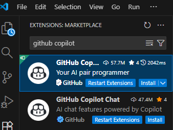
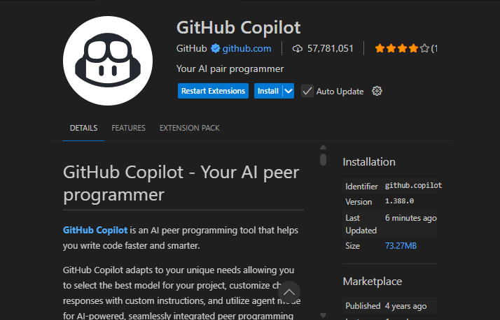
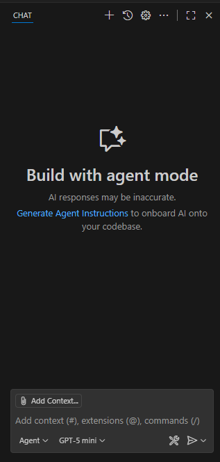
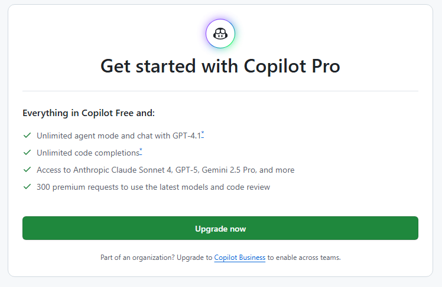
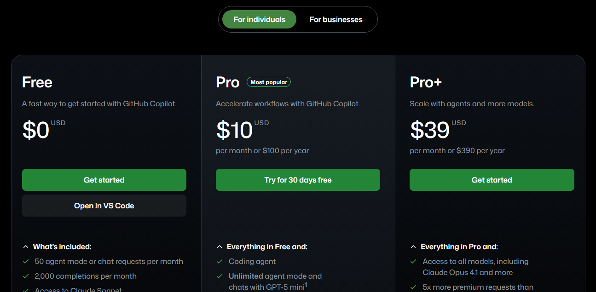
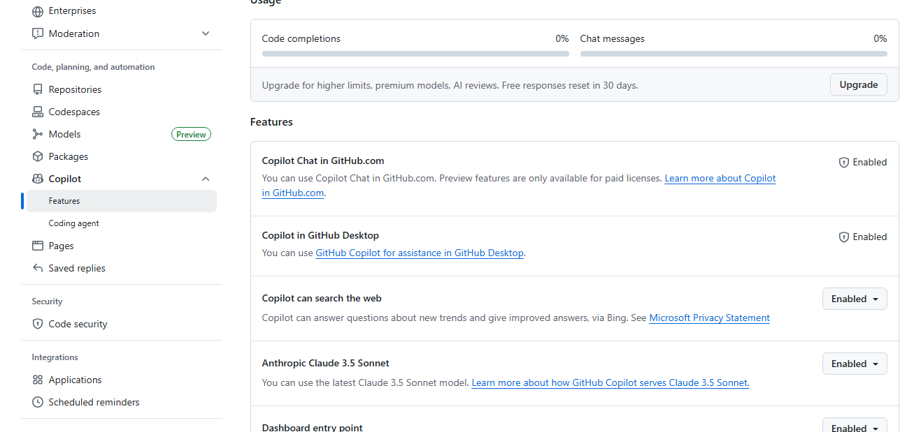
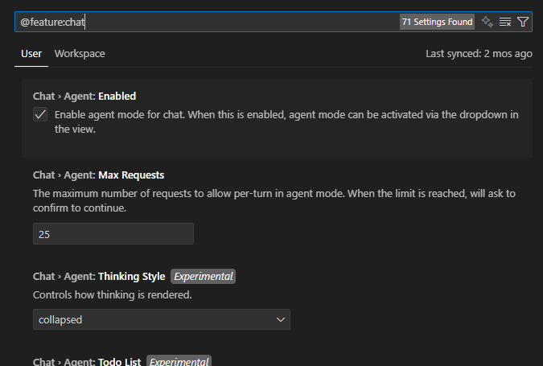
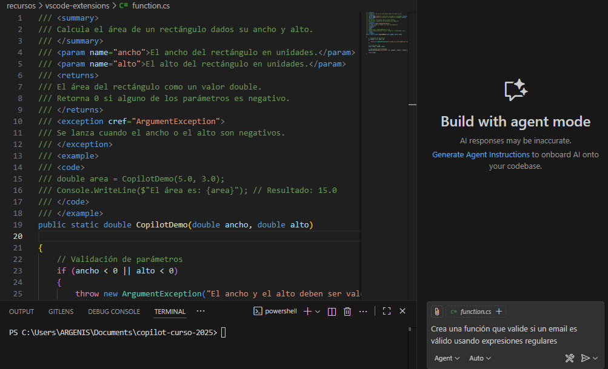
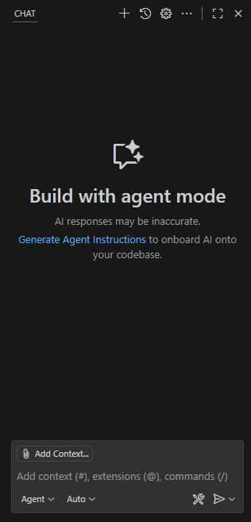

# 📦 01. Guía Detallada de Instalación de GitHub Copilot (Noviembre 2025)

Esta guía te llevará paso a paso a través del proceso de instalación de GitHub Copilot en tu entorno de desarrollo. **Para este curso, nos centraremos exclusivamente en la instalación y configuración con Visual Studio Code (VS Code)**, incluyendo las nuevas funcionalidades de noviembre 2025 como Plan Mode, subagentes y Agent Sessions.

> ⚠️ **Actualización Crítica - Noviembre 2025:**
> - **Modelo Predeterminado:** GPT-4.1 (reemplaza a GPT-4o que será retirado)
> - **Deprecación de Extensiones:** Copilot Extensions basadas en GitHub Apps serán deshabilitadas el 10 de noviembre de 2025
> - **Nuevos Requisitos:** VS Code 1.105+, Visual Studio 2022 17.14.16+

---

## 1. Requisitos Previos para el Curso (Noviembre 2025)

Antes de comenzar, asegúrate de tener:

- **Visual Studio Code 1.105+**: Este será nuestro IDE principal durante el curso. Si aún no lo tienes, puedes descargarlo desde [code.visualstudio.com](https://code.visualstudio.com/). Incluye el marketplace MCP integrado.
- **Visual Studio 2022 17.14.16+** (opcional): Para desarrollo .NET con Copilot app modernization.
- **Cuenta GitHub**: Necesaria para activar GitHub Copilot. La cuenta debe estar verificada.
- **Conexión a Internet Estable**: Necesaria para descargar extensiones y activar tu licencia de GitHub Copilot.
- **Suscripción GitHub Copilot**: Free (2,000 completions/mes), Pro, Pro+ o Enterprise con acceso a GPT-4.1 y funciones avanzadas.

---

## 2. Instalación de la Extensión de GitHub Copilot en Visual Studio Code

Sigue estos pasos para instalar GitHub Copilot directamente en VS Code:

1.  **Abrir Visual Studio Code**: Inicia tu editor VS Code.
2.  **Acceder al Panel de Extensiones**: Haz clic en el icono de Extensiones en la barra lateral izquierda (parece un cuadrado dividido en cuatro), o utiliza el atajo de teclado `Ctrl+Shift+X` (Windows/Linux) o `Cmd+Shift+X` (macOS).
    
3.  **Buscar "GitHub Copilot"**: En la barra de búsqueda que aparece en el panel de Extensiones, escribe "GitHub Copilot".
4.  **Instalar las Extensiones Oficiales**:
     - **GitHub Copilot**: Extensión principal de autocompletado
     - **GitHub Copilot Chat**: Asistente conversacional avanzado
    
5.  **Confirmar Activación**: Una vez instaladas, VS Code activará las extensiones automáticamente. Si se te solicita, recarga la ventana del editor para asegurar que GitHub Copilot se inicie correctamente.

---

## 3. Activación y Gestión de Cuenta (GitHub Copilot)

Después de instalar las extensiones, el siguiente paso es activar tu cuenta de GitHub Copilot.

1.  **Primera Activación de GitHub Copilot**: Al abrir o recargar VS Code, GitHub Copilot intentará iniciarse. Verás una notificación o un mensaje en la barra de estado inferior que te indicará que GitHub Copilot está listo para la activación.
    
2.  **Iniciar Sesión con GitHub**:
    - GitHub Copilot te pedirá que inicies sesión con tu cuenta GitHub. Se abrirá una ventana del navegador para autenticación.
    - Utiliza tus credenciales de GitHub. La cuenta debe estar verificada (requisito 2025).
      
3.  **Seleccionar Plan de Copilot**:
     - **Copilot Free**: 2,000 completions + 50 premium requests/mes (incluye funciones básicas)
     - **Copilot Pro**: Modelos avanzados (GPT-4.1) + funciones premium
     - **Copilot Pro+**: GPT-4.1 + GPT-5-Codex + funciones empresariales
     - **Copilot Enterprise**: Funciones completas para organizaciones
       
       
4.  **Configuración Inicial de Preferencias (Opcional)**: GitHub Copilot podría presentar un breve asistente para configurar tus preferencias iniciales, como los lenguajes de programación que utilizas o modelos de IA preferidos.
    

---

## 4. Verificación de Funcionamiento de GitHub Copilot

Para asegurarte de que GitHub Copilot está correctamente instalado y funcionando en VS Code:

1.  **Abrir un Archivo de Código**: Abre cualquier archivo de código compatible en VS Code (por ejemplo, un archivo `.cs`, `.ts`, `.js`, etc.).
2.  **Comenzar a Escribir Código**: Empieza a escribir una línea de código, una función o una variable. GitHub Copilot debería empezar a mostrar sugerencias de autocompletado avanzadas. Verás el logo de GitHub Copilot junto a las sugerencias.
    
    
3.  **Acceder al Panel de GitHub Copilot**: Puedes interactuar con GitHub Copilot haciendo clic en su icono en la barra de estado de VS Code o abriendo el panel de chat con `Ctrl+Alt+I`.
    

---

## 5. Nuevas Funcionalidades Noviembre 2025

### Plan Mode
- **Activación**: Selecciona "Plan" en el dropdown de agentes del chat
- **Capacidades**: Investigación y planificación de tareas complejas antes del desarrollo
- **Uso**: Ideal para proyectos grandes y estructurados

### Subagentes
- **Funcionalidad**: Agentes aislados para tareas específicas (investigación, análisis)
- **Ventajas**: Mejor gestión de contexto, tareas en segundo plano
- **Activación**: Usa `#runSubagent` en prompts

### Agent Sessions
- **Vista Unificada**: Gestiona sesiones locales y en la nube desde una interfaz
- **Integraciones**: Soporte para OpenAI Codex y GitHub Copilot CLI
- **Seguimiento**: Monitorea progreso de tareas complejas

### MCP Marketplace
- **Descubrimiento**: Explora e instala servidores MCP directamente en VS Code
- **Herramientas**: Integración con herramientas externas vía protocolo MCP
- **Autostart**: Servidores MCP se inician automáticamente

### Modelos Avanzados
- **GPT-4.1**: Modelo predeterminado (reemplaza GPT-4o)
- **GPT-5-Codex**: Optimizado para desarrollo de código
- **Modelos Especializados**: Para .NET, Angular, testing y más

### Code Review Mejorado
- **Integración con CodeQL/ESLint**: Detección determinística de problemas
- **Handoff a Coding Agent**: Entrega directa de correcciones sugeridas
- **Workflows Personalizables**: Adaptados a estándares del equipo

---

¡Felicidades! GitHub Copilot debería estar ahora completamente instalado, activo y listo para potenciar tu experiencia de codificación en Visual Studio Code con las últimas funcionalidades de noviembre 2025. Continúa con la siguiente guía para aprender a aprovechar al máximo sus funcionalidades actualizadas.

> 📝 **Nota Importante:** Si encuentras problemas con extensiones antiguas o modelos obsoletos, consulta la documentación oficial de GitHub Copilot para las últimas actualizaciones. El marketplace MCP integrado en VS Code 1.105+ facilita la instalación de herramientas adicionales.
