# 🎯 TESTING AUTOMATIZADO CON GITHUB COPILOT

## 📚 Buenas Prácticas de Testing Asistido por Copilot y Recomendaciones Finales

Este documento consolida las mejores prácticas, patrones y recomendaciones para aprovechar al máximo GitHub Copilot en el desarrollo de tests automatizados. Basado en experiencia real con proyectos .NET/Angular y las capacidades de Copilot en 2025.

---

## 🎨 Patrones Fundamentales de Testing

### 1. **Patrón AAA (Arrange-Act-Assert)**

El patrón más importante en testing unitario. Copilot lo respeta si tus tests existentes lo usan.

#### ✅ Estructura Correcta

```csharp
[Fact]
public async Task CreateTicket_ValidData_ReturnsSuccess()
{
    // ========== ARRANGE ==========
    // Setup: Dependencias, mocks, datos de prueba
    var mockRepo = new Mock<ITicketRepository>();
    var mockLogger = new Mock<ILogger<TicketService>>();
    var service = new TicketService(mockRepo.Object, mockLogger.Object);
    
    var createDto = new CreateTicketDto
    {
        Title = "Bug en Login",
        Priority = Priority.High,
        Description = "Usuario no puede iniciar sesión"
    };

    mockRepo.Setup(r => r.CreateAsync(It.IsAny<Ticket>()))
        .ReturnsAsync((Ticket t) => t);

    // ========== ACT ==========
    // Ejecución: Llamar al método bajo test
    var result = await service.CreateTicketAsync(createDto);

    // ========== ASSERT ==========
    // Verificación: Comprobar resultado esperado
    Assert.True(result.IsSuccess);
    Assert.Equal("Bug en Login", result.Value.Title);
    Assert.Equal(Priority.High, result.Value.Priority);
    Assert.Equal(Status.Open, result.Value.Status);
    
    // Verificar interacciones con dependencias
    mockRepo.Verify(r => r.CreateAsync(It.IsAny<Ticket>()), Times.Once);
    mockLogger.Verify(
        l => l.Log(
            LogLevel.Information,
            It.IsAny<EventId>(),
            It.IsAny<It.IsAnyType>(),
            null,
            It.IsAny<Func<It.IsAnyType, Exception, string>>()
        ),
        Times.AtLeastOnce
    );
}
```

#### ❌ Anti-Patrón: Todo Mezclado

```csharp
[Fact]
public async Task TestMethod()
{
    var service = new TicketService(new Mock<ITicketRepository>().Object);
    var result = await service.CreateTicketAsync(new CreateTicketDto { Title = "Test" });
    Assert.True(result.IsSuccess);
    var repo = new Mock<ITicketRepository>();
    // ❌ Orden confuso, difícil de mantener
}
```

### 2. **Convención de Nombres: MethodName_Scenario_ExpectedResult**

Nombres descriptivos hacen que tests fallen de forma clara.

#### ✅ Nombres Descriptivos

```csharp
// C# - xUnit
[Fact]
public void ValidateEmail_NullInput_ReturnsFalse() { }

[Fact]
public void ValidateEmail_ValidFormat_ReturnsTrue() { }

[Fact]
public void CalculateDiscount_PremiumUser_Returns20Percent() { }

[Fact]
public void CreateTicket_ClosedStatus_ThrowsInvalidOperationException() { }
```

```typescript
// TypeScript - Jasmine
describe('TicketService', () => {
  describe('getTickets', () => {
    it('should return empty array when no tickets exist', () => {});
    it('should return tickets sorted by creation date descending', () => {});
    it('should throw error when API returns 500', () => {});
  });
});
```

#### ❌ Anti-Patrón: Nombres Genéricos

```csharp
[Fact]
public void Test1() { }  // ❌ ¿Qué testea?

[Fact]
public void TestEmail() { }  // ❌ ¿Escenario? ¿Resultado?

[Fact]
public void ItWorks() { }  // ❌ ¿Qué funciona?
```

**Prompt para Copilot:**
```
"Genera tests con nombres descriptivos siguiendo patrón MethodName_Scenario_ExpectedResult.
Incluye al menos 5 casos cubriendo éxito, validaciones fallidas y excepciones."
```

---

## 📏 Cobertura de Código: Targets y Estrategias

### Métricas Recomendadas

| **Tipo de Código** | **Cobertura Mínima** | **Cobertura Ideal** | **Prioridad** |
|-------------------|---------------------|---------------------|---------------|
| **Controllers** | 70% | 85%+ | 🔴 Alta |
| **Services (Business Logic)** | 80% | 90%+ | 🔴 Crítica |
| **Repositories** | 70% | 85% | 🟡 Media |
| **Helpers/Extensions** | 80% | 90%+ | 🟡 Media |
| **DTOs/Models** | 50% | 70% | 🟢 Baja |
| **Validators** | 90% | 95%+ | 🔴 Crítica |

### Workflow de Cobertura con Copilot

```bash
# 1. Ejecutar análisis inicial
dotnet test /p:CollectCoverage=true /p:CoverletOutputFormat=cobertura

# 2. Generar reporte HTML (opcional)
reportgenerator -reports:coverage.cobertura.xml -targetdir:coverage-report

# 3. Identificar archivos críticos con baja cobertura
# Ejemplo: UserService.cs → 58% (objetivo: 85%)

# 4. Usar Copilot para generar tests faltantes
```

**Prompt Efectivo:**
```
"Analiza UserService.cs y genera tests para alcanzar 85% de cobertura.

Métodos prioritarios sin tests:
- UpdateUserProfileAsync (0% cobertura)
- ValidateUserPermissionsAsync (40% cobertura)
- DeactivateUserAsync (60% cobertura)

Para cada método incluye:
✅ Caso exitoso (happy path)
✅ Validaciones fallidas (datos inválidos)
✅ Excepciones (recursos no encontrados)
✅ Verificación de interacciones con repositorio

Usa xUnit, Moq, FluentAssertions."
```

### Estrategia de Priorización

```mermaid
graph TD
    A[Identificar código sin cobertura] --> B{Es código crítico?}
    B -->|Sí - Lógica de negocio| C[Prioridad 1: Generar tests ahora]
    B -->|Sí - Seguridad/Finanzas| C
    B -->|No - DTOs simples| D[Prioridad 3: Opcional]
    B -->|Medio - Helpers| E[Prioridad 2: Generar cuando haya tiempo]
    C --> F[Usar Copilot Agent Mode]
    E --> G[Usar /tests command]
    D --> H[Skip por ahora]
```



---

## 🧪 Testing de Diferentes Capas: Estrategias Específicas

### 1. **Controllers (ASP.NET Core API)**

#### Qué Testear
- ✅ Validación de ModelState
- ✅ Códigos HTTP correctos (200, 201, 400, 404, 401, 403)
- ✅ Autorización y autenticación
- ✅ Mapeo entre DTOs y respuestas
- ✅ Manejo de excepciones

#### Prompt Copilot para Controllers

```
"Genera suite completa de tests para TicketsController con cobertura de:

Endpoints a testear:
- GET /api/tickets (con paginación y filtros)
- GET /api/tickets/{id}
- POST /api/tickets
- PUT /api/tickets/{id}
- DELETE /api/tickets/{id}

Para cada endpoint incluir:
1. Caso exitoso con datos válidos (200/201)
2. Validación de ModelState inválido (400)
3. Recurso no encontrado (404)
4. Usuario sin autenticación (401)
5. Usuario sin permisos (403)

Mockear:
- ITicketService (lógica de negocio)
- ILogger<TicketsController>

Verificar:
- Códigos de estado HTTP correctos
- Respuestas con estructura ProblemDetails para errores
- Llamadas correctas a métodos del servicio

Usar xUnit, Moq, FluentAssertions."
```

#### Ejemplo Generado por Copilot

```csharp
public class TicketsControllerTests
{
    private readonly Mock<ITicketService> _mockService;
    private readonly Mock<ILogger<TicketsController>> _mockLogger;
    private readonly TicketsController _controller;

    public TicketsControllerTests()
    {
        _mockService = new Mock<ITicketService>();
        _mockLogger = new Mock<ILogger<TicketsController>>();
        _controller = new TicketsController(_mockService.Object, _mockLogger.Object);
    }

    [Fact]
    public async Task GetTickets_ValidRequest_ReturnsOkWithTickets()
    {
        // Arrange
        var tickets = new List<TicketDto>
        {
            new() { Id = 1, Title = "Bug 1", Status = "Open" },
            new() { Id = 2, Title = "Bug 2", Status = "Closed" }
        };
        var pagedResponse = new PagedResponse<TicketDto>(tickets, 1, 10, 2);

        _mockService.Setup(s => s.GetTicketsAsync(It.IsAny<GetTicketsQueryParameters>()))
            .ReturnsAsync(Result<PagedResponse<TicketDto>>.Success(pagedResponse));

        // Act
        var result = await _controller.GetTickets(new GetTicketsQueryParameters { Page = 1, PageSize = 10 });

        // Assert
        var okResult = Assert.IsType<OkObjectResult>(result);
        var response = Assert.IsType<PagedResponse<TicketDto>>(okResult.Value);
        Assert.Equal(2, response.TotalCount);
        Assert.Equal(2, response.Data.Count());
    }

    [Fact]
    public async Task GetTicketById_NonExistentId_ReturnsNotFound()
    {
        // Arrange
        _mockService.Setup(s => s.GetTicketByIdAsync(999))
            .ReturnsAsync(Result<TicketDto>.Failure("Ticket not found"));

        // Act
        var result = await _controller.GetTicketById(999);

        // Assert
        var notFoundResult = Assert.IsType<NotFoundObjectResult>(result);
        var problemDetails = Assert.IsType<ProblemDetails>(notFoundResult.Value);
        Assert.Contains("not found", problemDetails.Detail, StringComparison.OrdinalIgnoreCase);
    }

    [Fact]
    public async Task CreateTicket_InvalidModelState_ReturnsBadRequest()
    {
        // Arrange
        _controller.ModelState.AddModelError("Title", "Title is required");
        var dto = new CreateTicketDto();

        // Act
        var result = await _controller.CreateTicket(dto);

        // Assert
        var badRequestResult = Assert.IsType<BadRequestObjectResult>(result);
        Assert.IsType<ValidationProblemDetails>(badRequestResult.Value);
    }
}
```

### 2. **Services (Business Logic)**

#### Qué Testear
- ✅ Lógica de negocio compleja
- ✅ Validaciones de reglas de negocio
- ✅ Transformaciones de datos
- ✅ Orquestación de múltiples repositorios
- ✅ Manejo de transacciones

#### Prompt Copilot para Services

```
"Genera tests para TicketService.AssignTicketAsync con los siguientes escenarios:

Reglas de negocio:
- Solo usuarios con rol 'Agent' o 'Admin' pueden asignarse tickets
- No se pueden asignar tickets con status 'Closed'
- El ticket debe existir en la base de datos
- El usuario asignado debe existir y estar activo

Test cases requeridos:
1. ✅ Asignación exitosa (usuario Agent, ticket Open)
2. ❌ Usuario con rol 'User' intenta asignarse ticket → UnauthorizedException
3. ❌ Ticket con status 'Closed' → InvalidOperationException
4. ❌ TicketId no existe → NotFoundException
5. ❌ UserId no existe → NotFoundException
6. ❌ Usuario inactivo → InvalidOperationException
7. ✅ Verificar que se actualice AssignedToId y UpdatedAt
8. ✅ Verificar que se llame repository.UpdateAsync exactamente una vez

Mockear ITicketRepository e IUserRepository.
Usar FluentAssertions para asserts más legibles."
```

#### Ejemplo con FluentAssertions

```csharp
[Fact]
public async Task AssignTicketAsync_ValidAgentAndOpenTicket_ReturnsSuccess()
{
    // Arrange
    var ticketId = 1;
    var userId = 10;

    var ticket = new Ticket 
    { 
        Id = ticketId, 
        Title = "Bug", 
        Status = Status.Open,
        AssignedToId = null 
    };

    var user = new User 
    { 
        Id = userId, 
        Name = "John Doe", 
        RoleName = "Agent",
        IsActive = true 
    };

    _mockTicketRepo.Setup(r => r.GetByIdAsync(ticketId))
        .ReturnsAsync(ticket);
    _mockUserRepo.Setup(r => r.GetByIdAsync(userId))
        .ReturnsAsync(user);
    _mockTicketRepo.Setup(r => r.UpdateAsync(It.IsAny<Ticket>()))
        .ReturnsAsync((Ticket t) => t);

    // Act
    var result = await _service.AssignTicketAsync(ticketId, userId);

    // Assert
    result.IsSuccess.Should().BeTrue();
    result.Value.AssignedToId.Should().Be(userId);
    result.Value.UpdatedAt.Should().BeCloseTo(DateTime.UtcNow, TimeSpan.FromSeconds(5));

    _mockTicketRepo.Verify(
        r => r.UpdateAsync(It.Is<Ticket>(t => 
            t.Id == ticketId && 
            t.AssignedToId == userId
        )), 
        Times.Once
    );
}
```

### 3. **Repositories (Data Access)**

#### Qué Testear
- ✅ Queries correctas (filtros, ordenamiento, paginación)
- ✅ Operaciones CRUD completas
- ✅ Eager loading de relaciones
- ✅ Soft delete
- ✅ Manejo de transacciones

#### Usar InMemory Database

```csharp
public class TicketRepositoryTests : IDisposable
{
    private readonly ApplicationDbContext _context;
    private readonly TicketRepository _repository;

    public TicketRepositoryTests()
    {
        var options = new DbContextOptionsBuilder<ApplicationDbContext>()
            .UseInMemoryDatabase(databaseName: Guid.NewGuid().ToString())
            .Options;

        _context = new ApplicationDbContext(options);
        _repository = new TicketRepository(_context);

        SeedData();
    }

    private void SeedData()
    {
        _context.Tickets.AddRange(
            new Ticket { Id = 1, Title = "Bug 1", Status = Status.Open, Priority = Priority.High },
            new Ticket { Id = 2, Title = "Feature", Status = Status.Closed, Priority = Priority.Low },
            new Ticket { Id = 3, Title = "Bug 2", Status = Status.Open, Priority = Priority.Medium, IsDeleted = true }
        );
        _context.SaveChanges();
    }

    [Fact]
    public async Task GetAllAsync_ExcludesSoftDeletedTickets()
    {
        // Act
        var tickets = await _repository.GetAllAsync();

        // Assert
        tickets.Should().HaveCount(2);
        tickets.Should().NotContain(t => t.IsDeleted);
    }

    [Fact]
    public async Task GetByIdAsync_IncludesRelatedEntities()
    {
        // Arrange
        var ticket = new Ticket 
        { 
            Id = 4, 
            Title = "Test",
            CreatedById = 1
        };
        _context.Tickets.Add(ticket);
        _context.Users.Add(new User { Id = 1, Name = "Creator" });
        await _context.SaveChangesAsync();

        // Act
        var result = await _repository.GetByIdAsync(4, includeRelated: true);

        // Assert
        result.Should().NotBeNull();
        result.CreatedBy.Should().NotBeNull();
        result.CreatedBy.Name.Should().Be("Creator");
    }

    public void Dispose()
    {
        _context.Database.EnsureDeleted();
        _context.Dispose();
    }
}
```

### 4. **Componentes Angular**

#### Prompt para Component Testing

```
"Genera tests Jasmine para TicketListComponent que:

Component inputs:
- @Input() filters: TicketFilters
- @Output() ticketSelected: EventEmitter<Ticket>

Funcionalidades a testear:
1. Renderizado de lista de tickets desde servicio
2. Aplicación de filtros (status, priority)
3. Paginación (cambio de página)
4. Emisión de evento al seleccionar ticket
5. Loading state mientras carga datos
6. Error state cuando servicio falla
7. Empty state cuando no hay tickets

Mockear TicketService con spy objects.
Usar fixture.detectChanges() para trigger change detection."
```

#### Ejemplo Angular Component Test

```typescript
describe('TicketListComponent', () => {
  let component: TicketListComponent;
  let fixture: ComponentFixture<TicketListComponent>;
  let ticketServiceSpy: jasmine.SpyObj<TicketService>;

  const mockTickets: Ticket[] = [
    { id: 1, title: 'Bug 1', status: Status.Open, priority: Priority.High },
    { id: 2, title: 'Feature', status: Status.Closed, priority: Priority.Low }
  ];

  beforeEach(async () => {
    const spy = jasmine.createSpyObj('TicketService', ['getTickets', 'getTicketById']);

    await TestBed.configureTestingModule({
      imports: [TicketListComponent, HttpClientTestingModule],
      providers: [
        { provide: TicketService, useValue: spy }
      ]
    }).compileComponents();

    ticketServiceSpy = TestBed.inject(TicketService) as jasmine.SpyObj<TicketService>;
    fixture = TestBed.createComponent(TicketListComponent);
    component = fixture.componentInstance;
  });

  it('should display tickets when loaded successfully', () => {
    // Arrange
    ticketServiceSpy.getTickets.and.returnValue(of(mockTickets));

    // Act
    fixture.detectChanges(); // Triggers ngOnInit

    // Assert
    expect(component.tickets.length).toBe(2);
    const compiled = fixture.nativeElement as HTMLElement;
    const ticketElements = compiled.querySelectorAll('.ticket-item');
    expect(ticketElements.length).toBe(2);
  });

  it('should emit ticketSelected event when ticket is clicked', () => {
    // Arrange
    ticketServiceSpy.getTickets.and.returnValue(of(mockTickets));
    fixture.detectChanges();

    spyOn(component.ticketSelected, 'emit');

    // Act
    const compiled = fixture.nativeElement as HTMLElement;
    const firstTicket = compiled.querySelector('.ticket-item') as HTMLElement;
    firstTicket.click();

    // Assert
    expect(component.ticketSelected.emit).toHaveBeenCalledWith(mockTickets[0]);
  });

  it('should show loading state while fetching tickets', () => {
    // Arrange
    ticketServiceSpy.getTickets.and.returnValue(
      new Observable(subscriber => {
        // Emite después de delay
        setTimeout(() => subscriber.next(mockTickets), 100);
      })
    );

    // Act
    fixture.detectChanges();

    // Assert
    expect(component.isLoading).toBe(true);
    const compiled = fixture.nativeElement as HTMLElement;
    expect(compiled.querySelector('.loading-spinner')).toBeTruthy();
  });

  it('should show error message when service fails', () => {
    // Arrange
    const errorResponse = new HttpErrorResponse({
      error: 'Server error',
      status: 500,
      statusText: 'Internal Server Error'
    });

    ticketServiceSpy.getTickets.and.returnValue(throwError(() => errorResponse));

    // Act
    fixture.detectChanges();

    // Assert
    expect(component.error).toBeTruthy();
    const compiled = fixture.nativeElement as HTMLElement;
    expect(compiled.textContent).toContain('Error loading tickets');
  });
});
```

---

## 🎯 Uso Avanzado de Mocking

### Configuración de Mocks con Moq

#### Setup Básico

```csharp
// Setup simple: retornar valor
_mockRepo.Setup(r => r.GetByIdAsync(1))
    .ReturnsAsync(new Ticket { Id = 1, Title = "Test" });

// Setup con ANY: acepta cualquier parámetro
_mockRepo.Setup(r => r.CreateAsync(It.IsAny<Ticket>()))
    .ReturnsAsync((Ticket t) => t);

// Setup condicional: basado en parámetro
_mockRepo.Setup(r => r.GetByIdAsync(It.Is<int>(id => id > 0)))
    .ReturnsAsync((int id) => new Ticket { Id = id });

// Setup que lanza excepción
_mockRepo.Setup(r => r.DeleteAsync(999))
    .ThrowsAsync(new NotFoundException("Ticket not found"));
```

#### Verificación de Interacciones

```csharp
// Verificar que se llamó método exactamente una vez
_mockRepo.Verify(r => r.UpdateAsync(It.IsAny<Ticket>()), Times.Once);

// Verificar que NO se llamó
_mockRepo.Verify(r => r.DeleteAsync(It.IsAny<int>()), Times.Never);

// Verificar con parámetros específicos
_mockRepo.Verify(
    r => r.CreateAsync(It.Is<Ticket>(t => 
        t.Title == "Expected Title" && 
        t.Priority == Priority.High
    )), 
    Times.Once
);

// Verificar orden de llamadas
var sequence = new MockSequence();
_mockRepo.InSequence(sequence).Setup(r => r.GetByIdAsync(1));
_mockService.InSequence(sequence).Setup(s => s.ValidateAsync(It.IsAny<Ticket>()));
_mockRepo.InSequence(sequence).Setup(r => r.UpdateAsync(It.IsAny<Ticket>()));
```

### Mocking en Angular con Jasmine

```typescript
// Spy básico
const serviceSpy = jasmine.createSpyObj('TicketService', ['getTickets', 'createTicket']);

// Configurar retorno
serviceSpy.getTickets.and.returnValue(of(mockTickets));

// Configurar error
serviceSpy.createTicket.and.returnValue(
  throwError(() => new HttpErrorResponse({ status: 400 }))
);

// Verificar llamadas
expect(serviceSpy.getTickets).toHaveBeenCalled();
expect(serviceSpy.getTickets).toHaveBeenCalledTimes(1);
expect(serviceSpy.createTicket).toHaveBeenCalledWith(expectedTicket);
```

---

## 🚀 Prompts Efectivos: Biblioteca de Ejemplos

### Generación de Tests Completos

```
"Genera suite completa de tests xUnit para [ClassName] con:

Métodos a testear:
1. [Method1Name] - [brief description]
2. [Method2Name] - [brief description]

Para cada método incluir:
✅ Caso exitoso (happy path)
✅ Validaciones fallidas (datos inválidos)
✅ Excepciones esperadas (recursos no encontrados)
✅ Casos edge (null, empty, límites)

Estructura:
- Usar patrón AAA (Arrange-Act-Assert)
- Nombres: MethodName_Scenario_ExpectedResult
- Mockear dependencias con Moq
- Usar FluentAssertions para asserts
- Verificar interacciones con mocks

Cobertura objetivo: 90%+"
```

### Mejora de Tests Existentes

```
"Refactoriza estos tests para mejorar calidad:

Problemas actuales:
- Nombres genéricos (Test1, Test2)
- Sin patrón AAA claro
- Assertions débiles (solo NotNull)
- Sin verificación de mocks
- Sin casos edge

Aplicar:
✅ Renombrar con patrón MethodName_Scenario_ExpectedResult
✅ Separar en bloques Arrange-Act-Assert con comentarios
✅ Agregar assertions específicas (valores exactos, propiedades)
✅ Verificar llamadas a repositorios con .Verify()
✅ Agregar 3+ casos edge por método

Mantener funcionalidad existente, solo mejorar estructura."
```

### Tests E2E con Cypress

```
"Genera test Cypress E2E para flujo completo de gestión de tickets:

Escenario: Usuario Agent crea y asigna ticket

Steps:
1. Login como Agent (email: agent@test.com, password: Test@123)
2. Navegar a /tickets/create
3. Completar formulario:
   - Title: "Bug crítico en producción"
   - Priority: High
   - Description: "Sistema no responde"
4. Submit form
5. Verificar redirección a /tickets/{id}
6. Verificar mensaje de éxito
7. Verificar ticket aparece en lista de tickets

Assertions en cada paso:
- URLs correctas
- Elementos visibles en DOM
- Estados de botones (disabled/enabled)
- Mensajes de validación

Usar:
- cy.intercept() para mockear API si necesario
- data-testid para selectores estables
- Custom commands para login reutilizable"
```

---

## 📊 Checklist de Calidad de Tests

Antes de hacer commit de tests, verifica:

### ✅ Estructura y Organización

- [ ] Nombres descriptivos (MethodName_Scenario_ExpectedResult)
- [ ] Patrón AAA claramente definido con comentarios
- [ ] Un concepto por test (no múltiples asserts no relacionados)
- [ ] Tests agrupados en clases por componente testeado
- [ ] Fixtures/builders para datos de prueba reutilizables

### ✅ Asserts y Verificaciones

- [ ] Assertions específicas (valores exactos, no solo NotNull)
- [ ] Verificación de interacciones con mocks (.Verify())
- [ ] Manejo de casos edge (null, empty, límites)
- [ ] Validación de excepciones esperadas
- [ ] Time assertions con tolerancia (BeCloseTo para DateTime)

### ✅ Mocking y Aislamiento

- [ ] Todas las dependencias mockeadas (no servicios reales)
- [ ] Setup de mocks antes de Act
- [ ] Configuración de retornos esperados
- [ ] Sin dependencias entre tests (aislados)
- [ ] Cleanup en Dispose/afterEach si necesario

### ✅ Performance y Mantenibilidad

- [ ] Tests ejecutan en < 100ms cada uno (unitarios)
- [ ] Sin sleeps/delays innecesarios
- [ ] Sin dependencia de estado global
- [ ] Sin dependencia de orden de ejecución
- [ ] Código test es mantenible (DRY, helpers extraídos)

### ✅ Cobertura

- [ ] Happy path cubierto
- [ ] Validaciones cubiertas
- [ ] Excepciones cubiertas
- [ ] Casos edge cubiertos
- [ ] Cobertura general > 80% (lógica crítica > 90%)

---

## 🎓 Ejercicios Prácticos con Copilot

### Ejercicio 1: Test de Validador Complejo
```
Tarea: Genera tests para EmailValidator con estas reglas:
- Formato válido: user@domain.com
- Máximo 254 caracteres (RFC 5321)
- No permite espacios
- Requiere TLD válido (.com, .org, etc., no .123)
- Permite subdominios (user@mail.example.com)
- Permite + en nombre local (user+tag@domain.com)

Usa Theory con InlineData para 10+ casos.
```

### Ejercicio 2: Test de Servicio con Múltiples Dependencias
```
Tarea: Genera tests para OrderService.PlaceOrderAsync que depende de:
- IProductRepository (verificar stock)
- IPaymentService (procesar pago)
- IEmailService (enviar confirmación)
- ILogger

Incluye casos donde:
- Stock insuficiente → falla antes de pago
- Pago falla → no se envía email
- Todo exitoso → se llaman todos los servicios en orden correcto
```

### Ejercicio 3: Test E2E de Flujo Crítico
```
Tarea: Genera test Cypress para flujo de checkout:
1. Agregar producto al carrito
2. Ir a checkout
3. Completar información de envío
4. Seleccionar método de pago
5. Confirmar orden
6. Verificar página de confirmación

Mockea API de pagos con cy.intercept().
```

---

## 🚫 Errores Comunes y Cómo Evitarlos

### Error 1: Tests Frágiles
```csharp
// ❌ MAL: Dependencia de timing
[Fact]
public async Task Test()
{
    await service.ProcessAsync();
    await Task.Delay(1000); // ❌ Esperar arbitrariamente
    Assert.True(service.IsComplete);
}

// ✅ BIEN: Verificación explícita
[Fact]
public async Task Test()
{
    var result = await service.ProcessAsync();
    result.IsComplete.Should().BeTrue(); // ✅ Verificar retorno directamente
}
```

### Error 2: Tests que Dependen de Estado Global
```csharp
// ❌ MAL: Estado compartido
public class Tests
{
    private static List<Ticket> _tickets = new(); // ❌ Estático

    [Fact]
    public void Test1() 
    { 
        _tickets.Add(new Ticket()); 
        Assert.Equal(1, _tickets.Count); // ✅ Pasa
    }

    [Fact]
    public void Test2() 
    { 
        Assert.Equal(0, _tickets.Count); // ❌ Falla si Test1 ejecuta primero
    }
}

// ✅ BIEN: Instancia nueva por test
public class Tests
{
    private readonly List<Ticket> _tickets;

    public Tests()
    {
        _tickets = new(); // ✅ Nueva instancia por test
    }
}
```

### Error 3: Assertions Débiles
```csharp
// ❌ MAL: Assertion genérica
Assert.NotNull(ticket); // ¿Qué más debería validar?

// ✅ BIEN: Assertions específicas
ticket.Should().NotBeNull();
ticket.Id.Should().BePositive();
ticket.Title.Should().Be("Expected Title");
ticket.Status.Should().Be(Status.Open);
ticket.CreatedAt.Should().BeCloseTo(DateTime.UtcNow, TimeSpan.FromSeconds(5));
```

### Error 4: No Verificar Mocks
```csharp
// ❌ MAL: No verifica interacciones
[Fact]
public async Task Test()
{
    var result = await service.CreateAsync(ticket);
    Assert.True(result.IsSuccess); // ¿Se guardó en BD?
}

// ✅ BIEN: Verifica mock
[Fact]
public async Task Test()
{
    var result = await service.CreateAsync(ticket);
    Assert.True(result.IsSuccess);
    _mockRepo.Verify(r => r.SaveAsync(It.IsAny<Ticket>()), Times.Once); // ✅
}
```

---

## 🎯 Recomendaciones Finales

### 1. **Adopción Gradual**
- Empieza con tests para código nuevo (TDD)
- Agrega tests a código legacy al refactorizar (boy scout rule)
- Prioriza código crítico (pagos, autenticación, cálculos)

### 2. **Integración en Workflow**
```bash
# Pre-commit hook (Husky)
#!/bin/sh
dotnet test --no-build --verbosity quiet
if [ $? -ne 0 ]; then
  echo "❌ Tests failing, commit aborted"
  exit 1
fi
```

### 3. **CI/CD**
```yaml
# GitHub Actions
- name: Run Tests
  run: dotnet test /p:CollectCoverage=true /p:CoverageReportsFormat=cobertura

- name: Upload Coverage
  uses: codecov/codecov-action@v3
  with:
    files: ./coverage.cobertura.xml
```

### 4. **Métricas de Equipo**
- Sprint goal: +5% cobertura por sprint
- Definición de Done: Tests pasan + cobertura > 80%
- Code reviews: Revisar tests con mismo rigor que código

### 5. **Cultura de Testing**
- Tests como documentación viva
- Pair programming para tests complejos
- Refactorización continua de tests
- Celebrar hitos (80%, 90% cobertura)

---

## 🎬 Conclusión

El testing asistido por Copilot permite:

✅ **Velocidad**: 5-10x más rápido que manual  
✅ **Calidad**: Casos edge que humanamente se olvidan  
✅ **Aprendizaje**: Copilot enseña mejores prácticas  
✅ **Cobertura**: 80%+ alcanzable en semanas, no meses  
✅ **Confianza**: Deploy sin miedo con tests sólidos  

**Próximos pasos**:
1. Implementa tests en tu proyecto actual usando prompts de esta guía
2. Mide cobertura baseline y establece objetivos
3. Itera con Copilot para mejorar tests gradualmente
4. Comparte aprendizajes con el equipo

---

## 📚 Recursos Adicionales

### Documentación Oficial
- [xUnit Documentation](https://xunit.net/)
- [Moq Quickstart](https://github.com/moq/moq4/wiki/Quickstart)
- [Jasmine Testing Guide](https://jasmine.github.io/)
- [Cypress Best Practices](https://docs.cypress.io/guides/references/best-practices)

### Librerías Recomendadas
- **C#**: FluentAssertions, Bogus (datos fake), AutoFixture
- **Angular**: @testing-library/angular, ng-mocks, MSW (API mocking)

### Prompts Guardados
Crea archivo `.github/copilot-instructions.md` en tu repo:
```markdown
## Testing Guidelines

Al generar tests, siempre:
- Usar patrón AAA con comentarios
- Nombres: MethodName_Scenario_ExpectedResult
- Mockear todas las dependencias
- Incluir happy path + validaciones + excepciones
- FluentAssertions para asserts
- Verificar interacciones con mocks
```
